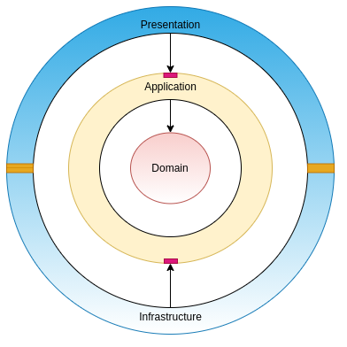

# Odyssey Publishers
  

This is a sample .NET Core 3.1 implementation of a RESTful Web API interface for a fictional book publishing house named Odyssey publishers.The APIs expose methods for manipulating two primary entities within this context, namely authors and books. Domain Driven Design (DDD) was followed for the architectural design. 

## Libraries Used ##
* AutoMapper
* Dapper
## Installation & Configuration ##
Once you clone the repo, create a new database (locally or as required) and use the CreateTables.sql and SeedData.sql scripts to generate the required database objects and load them with some seed data. 

Add your database connection string to the following files:

* `OdysseyPublishers.API/appsettings.json` 
* `TestUtils/appsettings.json`

## Solution Design ##
The core domain class contains the POCO classes for the core entities : book and author. The Application layer exposes interfaces into which the the Presentation and Infrastrucure layer plug into (the pink boxes in the diagram). All dependencies point inward towards the domain. This design makes each module of the solution modular and easily replaceable. 

The Application layer contains the main business logic and services for the domain entities, and also prescribes interfaces for the outer layers. The infrastructure layer implements the repository interfaces. The presentation layer makes use of the application services, defined Data Transfer Objects and Validation logic. 

## API Documentation ##
**Authors**

Type| Url | Response Codes |  Params
--- | --- | --- | ---
 `GET` | */api/authors* |`200 404` | *City={city}, State={state}*
 `GET` | */api/authors/{authorId}* |`200 404` |
 `POST`|*/api/authors*| `201`|
 `PUT` | */api/authors/{authorId}* | `204 404`|
 `PATCH` | */api/authors/{authorId}* | `204 404`|
 `DELETE` | */api/authors/{authorId}* | `204 404`|
 `HEAD`| */api/authors* | `200` |
 `OPTIONS`|*/api/authors*| `200` |
 
 
 **Books**
 Type| Url | Response Codes |  Params
--- | --- | --- | ---
 `GET` | */api/authors/{authorId}/books* |`200 404` | *Genre={genre}*
 `GET` | */api/authors/{authorId}/books/{bookId}*|`200 404` |
 `POST`|/api/authors/{authorId}/books| `201`|
 `PUT` |  */api/authors/{authorId}/books/{bookId}*| `204 404`|
 `PATCH` |  */api/authors/{authorId}/books/{bookId}* | `204 404`|
 `DELETE` |  */api/authors/{authorId}/books/{bookId}*| `204 404`|
 `HEAD`| /api/authors/{authorId}/books | `200` |
 `OPTIONS`|/api/authors/{authorId}/books| `200` |
 
 
